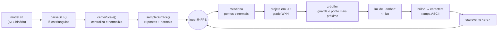

# `// profile` — Cartão de perfil com terminal CRT e renderizador 3D em ASCII

🌐 [English version](README.md)

Um cartão de visitas em uma única página: um terminal com estética CRT (scanlines,
flicker e glow) ao lado de um **modelo 3D renderizado inteiramente em ASCII**, que
você pode girar com o mouse. Sem Three.js, sem WebGL, sem dependências — só
JavaScript puro desenhando caracteres dentro de um `<pre>`.

O renderizador faz, na unha, o caminho completo de um pipeline de gráficos 3D:
lê uma malha `.stl`, amostra a superfície em pontos, rotaciona com matrizes,
resolve oclusão com z-buffer, calcula iluminação por normal e mapeia o brilho de
cada ponto para um caractere ASCII.

<!-- ===================================================================
     PREVIEW — adicione uma imagem ou GIF aqui depois de subir o repo:
       1. Abra o card no navegador, grave a tela girando o modelo
       2. Salve como docs/preview.gif
       3. Descomente a linha abaixo
     -->
<!-- <p align="center"></p> -->

## Demo

A forma mais simples de publicar: ative o **GitHub Pages** (Settings → Pages →
Branch `main` / `root`) e o card fica disponível em
`https://SEU-USUARIO.github.io/NOME-DO-REPO/`.

## Como o renderizador funciona

Tudo acontece em tempo real, a 30 quadros por segundo, redesenhando uma grade de
caracteres a cada frame. O fluxo é este:



Passo a passo:

**1. Leitura da malha (`parseSTL`).** Um arquivo STL binário é só um cabeçalho de
80 bytes, a quantidade de triângulos e, para cada triângulo, uma normal e três
vértices. A função lê esses bytes com um `DataView` e devolve a lista de triângulos.

**2. Normalização (`centerScale`).** O modelo é recentralizado na origem e escalado
para caber numa caixa de tamanho conhecido, para que qualquer `.stl` — grande ou
pequeno — apareça do mesmo jeito.

**3. Amostragem da superfície (`sampleSurface`).** Em vez de rasterizar triângulos,
o renderizador distribui `POINTS` pontos pela superfície, com probabilidade
proporcional à área de cada triângulo (triângulos maiores recebem mais pontos).
Cada ponto guarda também a **normal** da face, que será usada na iluminação.

**4. Rotação (a cada frame).** Os pontos e normais são multiplicados por uma matriz
de rotação 3×3, combinando a rotação automática com o que o usuário fez ao arrastar
(com inércia: ao soltar, o modelo continua girando e desacelera suavemente).

**5. Projeção 2D.** Cada ponto 3D vira uma coluna/linha da grade. O eixo vertical é
comprimido (`× 0.5`) porque caracteres de terminal são mais altos do que largos —
sem isso, o modelo apareceria esticado.

**6. Z-buffer.** Vários pontos podem cair na mesma célula da grade. O z-buffer
guarda, para cada célula, apenas o ponto mais próximo da câmera — é o que resolve a
oclusão (o que está na frente esconde o que está atrás).

**7. Iluminação (Lambert).** O brilho de cada ponto é o produto escalar entre a
normal (já rotacionada) e a direção da luz, limitado entre 0 e 1. Superfícies
viradas para a luz ficam claras; as que se afastam, escuras.

**8. Brilho → ASCII.** Esse valor de brilho indexa a rampa `" .:-=+*#%@"`, do
caractere mais "vazio" ao mais "denso". O resultado de toda a grade é montado numa
string e jogado no `<pre>` de uma vez.

A interação (arrastar para girar) usa eventos de ponteiro e alimenta a velocidade
de rotação; o resto da página — efeitos CRT, animação de "descriptografia" dos
textos e o player de áudio — é uma camada separada por cima do renderizador.

## Estrutura do projeto

```
.
├── index.html        → a página inteira (HTML + CSS + JS, ~23 KB)
├── assets/
│   ├── model.stl     → malha 3D renderizada em ASCII
│   ├── sprite.gif    → sprite animado do topo do card
│   └── music.mp3     → trilha de fundo (opcional, veja abaixo)
└── README.md
```

> Os três arquivos em `assets/` antes ficavam embutidos em base64 dentro do HTML
> (deixando o arquivo com ~13 MB). Separá-los deixou o `index.html` legível e fácil
> de versionar.

## Rodando localmente

Como o card busca o `.stl` via `fetch()`, ele precisa ser servido por HTTP (abrir o
arquivo direto pelo `file://` não carrega o modelo — nesse caso entra um modelo
de fallback gerado por código, então a página nunca quebra). Para ver a versão
completa, suba um servidor local:

```bash
# Python 3
python3 -m http.server 8000
# depois abra http://localhost:8000
```

## Personalizando

Quase tudo que muda por pessoa está num único bloco `CONFIG` no topo do `<script>`
em `index.html`, marcado com **`EDITE AQUI`**:

```js
const CONFIG = {
  termTitle:  "Boa noite @usuario",
  handle:     "Seu Nome",
  role:       "• Cargo • Tagline",
  bio:        "Uma linha sobre você",
  promptText: "Sua frase no rodapé.",

  links: [
    { cmd: "github", val: "@usuario", url: "https://github.com/usuario" },
    // adicione/remova quantos quiser
  ],

  stlUrl: "assets/model.stl",   // troque por qualquer .stl em assets/
  // ...ajustes finos de renderização abaixo
};
```

Para trocar o **modelo 3D**, coloque outro arquivo `.stl` em `assets/` e atualize
`stlUrl`. Para trocar ou remover a **música**, substitua `assets/music.mp3` (ou
apague o arquivo e a tag `<audio>` para um repositório mais leve).

## Tecnologias

HTML, CSS e JavaScript puro — sem frameworks nem dependências. As fontes vêm do
Google Fonts (`Share Tech Mono` e `VT323`).
